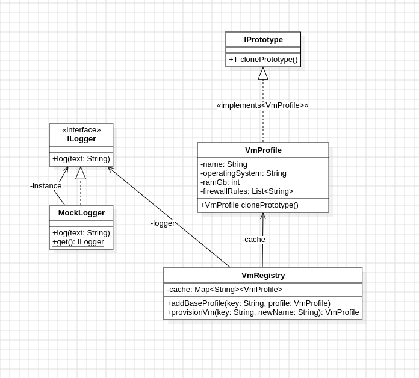

# LP5_Prototype

Este projeto visa implementar um sistema de provisionamento de máquinas virtuais, de modo que se possa criar várias VMs diferentes usando o mesmo modelo de forma consistente e sem a necessidade de repetir os mesmos dados sempre. Simplesmente criamos um registro dos perfis de máquina e os clonamos conforme a necessidade. Com isso, temos uma implementação prática do padrão Prototype.

## Diagrama de Classe

